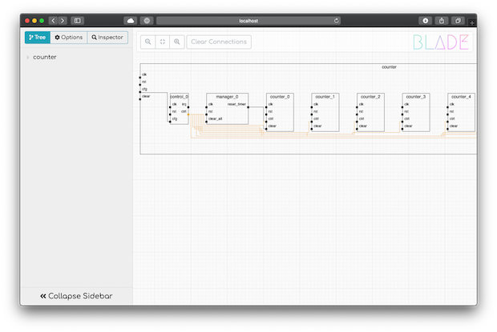

---

# BLADE Viewer
BLADE Viewer is a NodeJS web app for browsing DesignFormat blobs generated by BLADE. It allows the user to visually explore a design's hierarchy and trace interconnections between ports on different blocks. It also provides the ability to inspect a block or port to determine basic properties.

<p align="center">
  
</p>

## Getting Started

You will need to install [NodeJS](https://nodejs.org/en/) on your system, the preferred way of doing this is to use NVM ([further details are available on GitHub](https://github.com/creationix/nvm)):

```bash
$> curl -o- https://raw.githubusercontent.com/nvm-sh/nvm/v0.35.1/install.sh | bash
$> . ~/.bashrc
$> nvm install 12.13.1
$> nvm alias default 12.13.1
```

Then you will need to clone a copy of BLADE Viewer - a recursive clone is used to also pull down a copy of DesignFormat:

```bash
$> git clone --recursive git@github.com:/bluwireless/blade-viewer
```

Next you need to install the dependencies for BLADE Viewer using NPM (Node Package Manager):

```bash
$> cd blade-viewer
$> npm install
```

Now you can start up a local server on port 8085 (edit config.js to change the default port number):

```bash
$> node index.js
```

Finally, navigate to `http://localhost:8085` in a web browser on the same machine you are running the server. You should see the welcome page asking you to provide a path to the DesignFormat blob on the disk.

## Running BLADE Viewer as a Service

If you want to run BLADE Viewer on a shared machine as a central service, we recommend using [PM2](https://pm2.keymetrics.io) to manage the Node JS process. It's really simple to get up and running:

```bash
$> npm install -g pm2
$> cd blade-viewer
$> pm2 start index.js --name BLADE
```

# Acknowledgements
BLADE Viewer uses a number of third party libraries which are subject to their respective licenses:

 * [Bootstrap](https://getbootstrap.com) - CSS layout library
 * [Spinkit](https://tobiasahlin.com/spinkit/) - CSS spinners
 * [Bootstrap Toggle](http://www.bootstraptoggle.com) - Toggle switch for Bootstrap
 * [JSZip](https://stuk.github.io/jszip/) - Compression for transferring DesignFormat blobs
 * [Random Color](https://github.com/davidmerfield/randomColor/) - Javascript library for choosing a random color
 * [jsTree](https://www.jstree.com) - Interactive hierarchical tree browser
 * [FontAwesome](https://fontawesome.com) - CSS icon font
 * [Comfortaa](https://fonts.google.com/specimen/Comfortaa) - Google Comfortaa font
